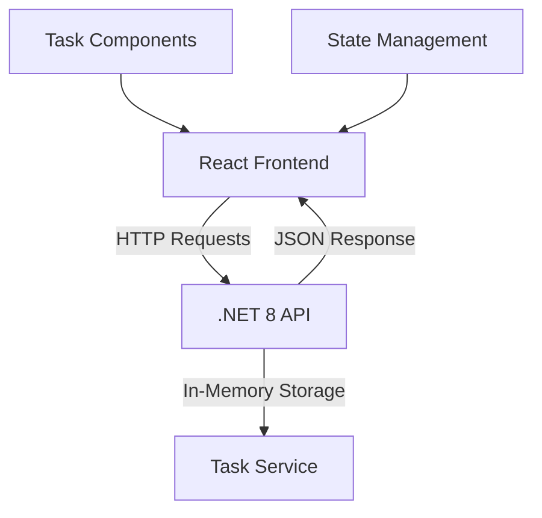
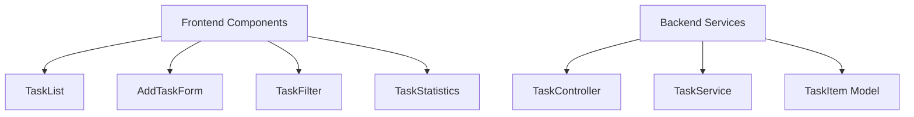

# Task Manager Application

## Problem Statement
Create a full-stack task management application using .NET 8 for the backend and React with TypeScript for the frontend.

### Core Requirements
1. **Backend (.NET 8)**
   - Implement RESTful API
   - Use in-memory data storage
   - Define TaskItem model with properties:
     - ID
     - Description
     - Completion status

2. **Frontend (React + TypeScript)**
   - Single-page application
   - Display task list
   - Add new tasks
   - Toggle completion status
   - Delete tasks
   - Use Axios/Fetch for API integration
   - React Hooks for state management

## Solution Approach

### High-Level Design (HLD)


### Low-Level Design (LLD)


### Enhanced Features Implementation
1. **Task Model Enhancement**
   - Priority levels (Low, Medium, High)
   - Due dates
   - Tags system
   - Creation and completion timestamps
   - Time tracking

2. **UI/UX Improvements**
   - Task statistics dashboard
   - Priority-based filtering
   - Tag-based organization
   - Completion rate visualization

## Development Challenges & Solutions

### 1. Backend Data Model Synchronization
**Challenge:** Initially faced issues with data model consistency between frontend and backend.
```typescript
// Frontend Model
interface Task {
  id: string;
  description: string;
  isCompleted: boolean;
  // ...other properties
}

// Backend Model
public class TaskItem {
    public Guid Id { get; set; }
    public string Description { get; set; }
    public bool IsCompleted { get; set; }
    // ...other properties
}
```
**Solution:** 
- Implemented strict type checking in TypeScript
- Added proper model validation in the backend
- Ensured consistent property naming

### 2. API Communication Issues
**Challenge:** Encountered 400 Bad Request errors when creating tasks.
**Solution:**
- Added proper JSON serialization configuration
- Implemented enum string conversion
- Added explicit error handling and validation
```csharp
builder.Services.AddControllers().AddJsonOptions(options =>
{
    options.JsonSerializerOptions.PropertyNameCaseInsensitive = true;
    options.JsonSerializerOptions.Converters.Add(new JsonStringEnumConverter());
});
```

### 3. State Management
**Challenge:** Managing complex task states and updates.
**Solution:**
- Implemented centralized state management
- Added optimistic UI updates
- Implemented proper error handling and recovery

## Getting Started
1. Navigate to the frontend directory:
   ```bash
   cd TaskManager/task-manager-frontend
   ```

2. Install dependencies:
   ```bash
   npm install
   ```

3. Start the development server:
   ```bash
   npm run dev
   ```
   The application will be available at `http://localhost:5173`.

### Technical Implementation Details

### Backend Architecture
1. **Controller Layer**
   - REST endpoints
   - Input validation
   - Error handling
   - Response formatting

2. **Service Layer**
   - Business logic
   - In-memory data management
   - CRUD operations

3. **Model Layer**
   - Rich domain models
   - Data validation
   - Type safety

### Frontend Architecture
1. **Component Structure**
   ```
   src/
   ├── components/
   │   ├── TaskList.tsx
   │   ├── AddTaskForm.tsx
   │   ├── TaskFilter.tsx
   │   └── TaskStatistics.tsx
   ├── services/
   │   └── taskService.ts
   └── types/
       └── Task.ts
   ```

2. **State Management**
   - React Hooks for local state
   - Prop drilling minimization
   - Optimistic updates

3. **API Integration**
   - Centralized API service
   - Error handling
   - Request/response interceptors

## Performance Considerations
1. **Frontend**
   - Optimistic UI updates
   - Proper error handling
   - Type safety
   - Efficient re-renders

2. **Backend**
   - In-memory data structure optimization
   - Proper model validation
   - Error handling
   - Response caching

## Lessons Learned
1. **Type Safety Importance**
   - Strong typing between frontend and backend
   - Runtime type checking
   - Proper model validation

2. **Error Handling**
   - Comprehensive error messages
   - User-friendly error displays
   - Proper error recovery

3. **API Design**
   - Consistent response formats
   - Proper HTTP status codes
   - Comprehensive API documentation

### Prerequisites and Setup
1. **Requirements**
   - .NET 8 SDK
   - Node.js (v14 or later)
   - npm/yarn
   - Visual Studio Code (recommended)

2. **Backend Setup**
   ```bash
   cd TaskManager.API
   dotnet restore
   dotnet run
   ```

3. **Frontend Setup**
   ```bash
   cd task-manager-frontend
   npm install
   npm run dev
   ```

4. **Access Points**
   - Frontend: http://localhost:5173
   - Backend: http://localhost:5000
   - Swagger UI: http://localhost:5000/swagger

## Future Enhancements

1. **Data Persistence**
   - Database integration
   - User authentication
   - Task history

2. **Advanced Features**
   - Task dependencies
   - Recurring tasks
   - File attachments
   - Task comments

3. **UI Improvements**
   - Dark mode
   - Customizable themes
   - Keyboard shortcuts
   - Drag-and-drop support

## Contributing

1. Fork the repository
2. Create a feature branch
3. Commit your changes
4. Push to the branch
5. Create a pull request

## License

This project is licensed under the MIT License.